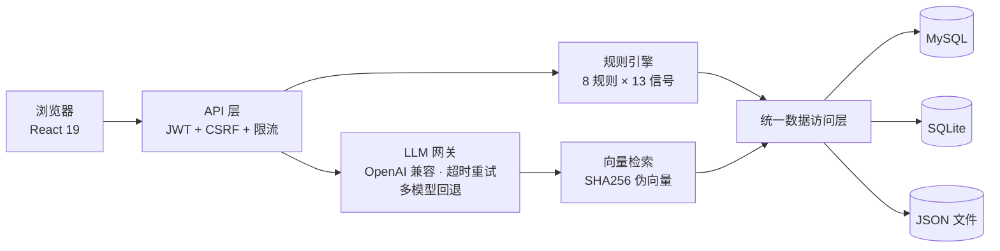

# Retail Audit AI Agent · 零售业 AI 审计工作台

[](./LICENSE)
[](https://github.com/GOOD-123-CPU/retail-audit-agent/actions/workflows/ci.yml)


简体中文 | [English](#english)

一款开箱即用的**零售业 AI 审计工作台**：上传企业经营与票据资料 → 规则引擎识别风险 → 大模型解释与问答 → 审批流 → 审计底稿 → Markdown 审计报告，覆盖审计作业全流程。

> ⚠️ **免责声明**：本项目用于审计教学、演示与研究辅助，输出结果不构成任何法定审计意见，不能替代注册会计师依据执业准则执行的审计工作。

---

## ✨ 核心特性

- **规则驱动的风险识别**：内置 8 类零售业风险规则（收入舞弊、门店扩张、存货积压、返利费用、毛利率恶化、退货异常、收入质量、费用归集），基于 13 项财务指标阈值（营收增速、退货率、存货周转、毛利率趋势、应收周转等）与文档关键词双信号评分，规则支持页面上自定义。
- **大模型风险解释与问答**：接入任意 **OpenAI 兼容 API**（默认阿里云百炼 DashScope，可换 DeepSeek / vLLM / Ollama 等），每个风险附带 AI 解释与审计程序建议；支持基于项目资料的多轮问答，回答附带引用溯源。超时重试、多模型回退链、无 Key 本地降级三重保障。
- **多格式资料解析**：xlsx / csv / pdf（pdf-parse）/ 图片 OCR（tesseract.js 中文）/ txt / md，内置乱码自动修复与发票、合同关键字段抽取。
- **轻量向量检索**：SHA256 伪向量 + 余弦相似度，零外部 embedding 依赖，即可支撑资料片段召回。
- **完整审计作业流**：项目 → 资料上传 → 风险分析 → 审批（提交/通过/驳回留痕）→ 底稿自动生成 → Markdown 报告导出。
- **三种存储模式**：MySQL（生产）/ SQLite（零依赖单机）/ JSON 文件（兜底），连接失败自动降级、自愈回写。
- **生产级工程化**：Docker 多阶段构建 + compose 编排 + healthcheck、46 个单元测试 + CI 门禁、JWT/PBKDF2/CSRF/限流全套安全。
- **开箱即用的演示**：一条命令生成含 6 份演示资料的完整示例项目。

## 🐳 Docker 一键部署（推荐）

```bash
# SQLite 模式（默认，零外部依赖）
JWT_SECRET=$(openssl rand -base64 48) docker compose up -d
# 打开 http://localhost:3000

# MySQL 模式（含数据库服务）
JWT_SECRET=$(openssl rand -base64 48) \
MYSQL_ROOT_PASSWORD=<root密码> MYSQL_PASSWORD=<业务密码> \
docker compose --profile mysql up -d
```

镜像为多阶段 standalone 构建（<200MB）、非 root 运行、内置 `/api/health` 健康检查。

## 🚀 本地开发

### 环境要求

- Node.js ≥ 20
- （可选）MySQL 5.7+ / 8.0 —— 不装也能运行（SQLite/JSON 模式）
- （可选）任一 OpenAI 兼容模型的 API Key —— 不配也能运行（AI 解释与问答回退为本地规则应答）

### 安装与启动

```bash
npm install
cp .env.example .env.local   # Windows: copy .env.example .env.local
```

编辑 `.env.local`，至少配置 `JWT_SECRET`（如 `openssl rand -base64 48` 生成）。

```bash
# 初始化数据库（MySQL/SQLite）并生成演示项目
npm run db:init
npm run seed

npm run dev
```

打开 http://localhost:3000 ，使用演示账号登录：

| 角色 | 邮箱 | 密码 |
|------|------|------|
| 管理员 | `admin@retail-audit.local` | `AdminDemo_2026` |
| 企业用户 | `company@retail-audit.local` | `CompanyDemo_2026` |

> 演示账号仅用于本地体验，生产部署请通过 `DEFAULT_ADMIN_*` / `DEFAULT_COMPANY_USER_*` 环境变量覆盖。

### 一键脚本（Windows）

```powershell
powershell -ExecutionPolicy Bypass -File .\scripts\start-system.ps1
```

脚本会自动执行 `db:init`、启动应用并打开浏览器，详见 `scripts/` 与 `docs/`。

## 🧭 功能导览

| 页面 | 说明 |
|------|------|
| `/projects` | 项目列表与新建 |
| `/projects/[id]` | 项目工作台：总览 / AI 问答 / 审计报告 / 底稿 四视图 |
| `/projects/batch` | 批量创建、批量分析、批量审批 |
| `/admin/rules` | 风险规则管理（增删改、权重调整） |
| `/admin/users` | 用户与角色管理（创建、调整、移除，保护最后一名管理员） |

## 🧪 测试

项目使用 [Vitest](https://vitest.dev/) 覆盖规则评分、向量检索、乱码修复、HTTP 安全层、限流、权限、字段抽取与分析编排（46 个用例）：

```bash
npm run test           # 单次运行
npm run test:watch     # 监听模式
npm run test:coverage  # 覆盖率报告
```

CI（GitHub Actions）会在每次 push / PR 时自动执行类型检查、单元测试与生产构建。

## 🏗️ 技术架构



完整模块设计、评分模型、请求时序与扩展点见 **[docs/架构深度解析.md](./docs/架构深度解析.md)**。

```
Next.js 15 App Router (React 19, TS)
├── 页面层   app/            11 个页面路由
├── API 层   app/api/        17 个 REST 端点（JWT 鉴权 + CSRF 校验 + 限流）
├── 业务层   lib/
│   ├── rules.ts       风险规则引擎（8 规则 × 13 财务信号 × 关键词证据）
│   ├── ai.ts          OpenAI 兼容大模型调用（超时重试 + 多模型回退链）
│   ├── analysis.ts    分析编排（规则 → 3 并发 AI 解释 → 报告 → 底稿）
│   ├── vector-search  轻量向量检索（SHA256 伪向量 + 余弦相似度）
│   ├── parsers.ts     xlsx/csv/pdf/OCR 解析 + 乱码修复
│   └── db.ts          统一数据访问层（MySQL ⇄ SQLite ⇄ JSON 自动切换）
└── 数据层   db/schema.sql    7 张表（SQLite 内嵌同构 Schema）
```

## 🔧 配置参考

全部配置见 [.env.example](./.env.example)，关键项：

| 变量 | 说明 | 默认 |
|------|------|------|
| `JWT_SECRET` | 会话签名密钥，生产环境必填（≥16 字符） | 无 |
| `DATABASE_PROVIDER` | 存储模式：`mysql` / `sqlite` / `json` | `mysql` |
| `SQLITE_PATH` | SQLite 数据库文件路径（sqlite 模式） | `data/retail-audit.db` |
| `QWEN_API_URL` | OpenAI 兼容 chat/completions 端点 | DashScope 兼容模式 |
| `QWEN_API_KEY` | 模型 API Key，未配置则回退本地规则应答 | 无 |
| `QWEN_PRIMARY_MODEL` / `QWEN_FALLBACK_MODELS` | 主模型与逗号分隔的备用模型链 | `qwen3-max` / `qwen-plus,qwen-turbo` |
| `MYSQL_*` | MySQL 连接（mysql 模式；连接失败自动降级） | 见 .env.example |

## 🗺️ 路线图

- [ ] 报告可视化图表（月度财务趋势、风险矩阵）
- [ ] 真实 embedding API 可插拔接入
- [ ] OIDC / 企业微信 SSO 登录
- [ ] Redis 限流与会话存储（多副本部署支持）
- [ ] 英文界面（i18n）

> 更新历史见 [CHANGELOG.md](./CHANGELOG.md)。

## ⭐ Star 历史

[](https://star-history.com/#GOOD-123-CPU/retail-audit-agent&Date)

## 🤝 贡献

欢迎 Issue 与 PR，请先阅读 [CONTRIBUTING.md](./CONTRIBUTING.md) 与 [行为准则](./CODE_OF_CONDUCT.md)。安全漏洞请勿公开发布 Issue，参见 [SECURITY.md](./SECURITY.md)。

## 📄 许可证

[MIT](./LICENSE) 。演示数据均为虚构，如有雷同纯属巧合。

---

# English

An out-of-the-box **AI-powered retail audit workbench**: upload business & invoice documents → rule-based risk detection → LLM explanation & Q&A → approval workflow → audit working papers → Markdown audit report.

> ⚠️ **Disclaimer**: This project is for audit education, demonstration and research assistance only. Its output does not constitute any legal audit opinion and cannot replace statutory audits performed by CPAs.

## Features

- **Rule-driven risk detection** — 8 built-in retail risk rules scored by 13 financial signal thresholds × document keywords; rules editable from the admin UI.
- **LLM explanation & grounded Q&A** — works with **any OpenAI-compatible API** (DashScope by default; DeepSeek / vLLM / Ollama also fine). Timeout & retry, multi-model fallback chain, and full local degradation without an API key. Answers include citation traceability.
- **Multi-format ingestion** — xlsx / csv / pdf / image OCR (Chinese) / txt / md, with mojibake auto-repair and invoice & contract field extraction.
- **Lightweight vector search** — SHA256 pseudo-embeddings + cosine similarity, zero external embedding dependency.
- **Full audit workflow** — projects → uploads → analysis → approval (with history) → auto working papers → Markdown report.
- **Three storage modes** — MySQL (production) / SQLite (zero-dependency) / JSON files (fallback), with automatic degradation and self-healing.
- **Production-grade engineering** — Docker multi-stage build + compose + healthcheck, 46 unit tests with CI gate, JWT/PBKDF2/CSRF/rate-limiting security stack.

## Quick Start

### Docker (recommended)

```bash
# SQLite mode (default, zero external dependencies)
JWT_SECRET=$(openssl rand -base64 48) docker compose up -d
# open http://localhost:3000
```

### Local development

```bash
npm install
cp .env.example .env.local    # set JWT_SECRET (e.g. openssl rand -base64 48)
npm run db:init
npm run seed
npm run dev
```

Open http://localhost:3000 and sign in with the demo accounts listed above. Requires Node.js ≥ 20. MySQL and an LLM API key are optional — the app degrades gracefully without them.

## Documentation

- [Architecture Deep Dive](./docs/架构深度解析.md) — module design, scoring model, sequence diagrams and extension points
- [Changelog](./CHANGELOG.md)

## License

[MIT](./LICENSE). All demo data is fictional.
