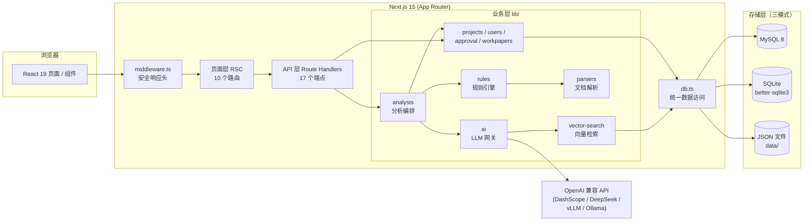
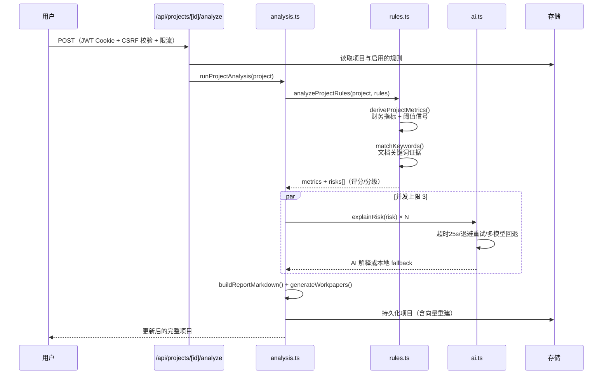

# 架构深度解析 / Architecture Deep Dive

本文面向希望理解系统内部原理、参与核心开发或做二次扩展的工程师。
快速上手请看 [README](../README.md)。

## 系统总览



## 请求生命周期（以"执行风险分析"为例）



## 核心模块设计

### 1. 规则引擎（`lib/rules.ts`）

**双信号评分模型**，每个风险得分 = 关键词命中数 × 14 + 财务信号数 × 16/18：

- **关键词证据**：对每条资料全文匹配规则的 `triggerKeywords`，命中即生成
  带上下文摘录的证据项（`sourceExcerpt` 保留前后 60 字符）。
- **财务信号**：`deriveProjectMetrics` 从结构化表格行（中英文列名别名映射）
  聚合 13 项指标，按阈值产出信号：

| 信号 | 触发条件 | 审计含义 |
|------|---------|---------|
| `revenue_growth_spike` | 营收同比 > 25% | 增长异常需核实真实性 |
| `return_rate_spike` | 退货率 > 8% | 冲量后回冲迹象 |
| `receivable_mismatch` | 应收增速 − 营收增速 > 15pp | 放宽信用换收入 |
| `receivable_turnover_slow` | 应收周转天数 > 45 天 | 回款能力恶化 |
| `gross_margin_drop` | 平均毛利率 < 18% | 盈利能力异常 |
| `gross_margin_downtrend` | 趋势斜率 < −0.3pp/期 | 持续恶化 |
| `return_rate_downtrend_reversal` | 后半程/前半程 > 1.2× | 期末集中退货 |
| `inventory_growth_high` | 存货增速 − 营收增速 > 15pp | 积压风险 |
| `inventory_turnover_slow` | 周转天数 > 120 天 | 去化困难 |
| `store_growth_fast` | 门店增速 > 15% | 扩张激进 |
| `revenue_per_store_decline` | 单店收入 < −8% | 扩张质量差 |
| `rebate_expense_spike` | 返利费用率 > 6% | 费用舞弊风险 |
| `marketing_expense_spike` | 市场费用率 > 8% | 费用舞弊风险 |
| `total_expense_rate_high` | 费用合计 > 12% | 归集异常 |
| `document_support_gap` | 票据缺关键ocab字段 | 证据链薄弱 |

- **分级**：≥75 高风险 / ≥45 中风险 / ≥30 低风险（低于 30 丢弃）。
- **可扩展**：规则存于 `rule_configs` 表（含 JSON 定义），管理员可在
  `/admin/rules` 页面增删改与启停，无需改代码。

### 2. AI 网关（`lib/ai.ts`）

- **OpenAI 兼容协议**：只依赖标准 `chat/completions` 契约，任何兼容服务
  （DashScope、DeepSeek、vLLM、Ollama、one-api 网关）均开箱即用。
- **多模型回退链**：主模型失败按 `QWEN_FALLBACK_MODELS` 顺序降级。
- **弹性**：单请求 25s AbortController 超时；408/429/5xx 指数退避重试
  （500ms → 1s）；超时（AbortError）不重试当前模型、直接切换。
- **降级闭环**：`explainRisk` 失败用规则证据拼装本地解释；
  `answerProjectQuestion` 失败走 `buildChatFallback`——基于规则+向量检索的
  本地应答，附 `answeredBy: "fallback"` 与置信度标记，前端可区分展示。
  **即完全不配置 AI Key，系统全部功能依然可用。**

### 3. 向量检索（`lib/vector-search.ts`）

零外部 embedding 服务的轻量方案：

1. **分词**：中文 1–4 字窗口 + 英文数字词元（正则 `[\u4e00-\u9fff]{1,4}|[a-z0-9_]+`）。
2. **嵌入**：每个词元 SHA256 哈希映射到 64 维向量的一位（带符号），L2 归一化
   ——本质是 Bag-of-Words 的哈希压缩，语义能力有限但**零依赖、零成本、确定性**。
3. **检索**：余弦相似度 top-4（阈值 > 0.08），MySQL/SQLite 持久化或纯内存双模式。

> 扩展点：`embedText` 是唯一嵌入实现入口，替换为真实 embedding API
> （如 text-embedding-v3）只需改这一个函数并同步向量维度。

### 4. 统一数据访问层（`lib/db.ts`）

```
上层（stores / vector-search）     只认 queryRows / executeStatement / ?
        │
   activeProvider()
   ┌────┴─────────┬──────────────┐
mysql2 Pool   better-sqlite3   （不启用 → 调用方回退 JSON 文件）
(连接池)      (WAL, 同步 API
               包装为 async)
```

- **占位符统一**：MySQL 与 SQLite 均使用 `?` 占位符，上层 SQL 无需区分。
- **Schema 同构**：SQLite 内嵌建表语句与 `db/schema.sql` 字段一一对应。
- **降级链**：MySQL 连接失败 → 各 store 捕获后回退 JSON 文件 → 文件库发现
  有数据还会回写数据库（自愈迁移）。

### 5. 安全模型

| 层 | 机制 | 位置 |
|----|------|------|
| 会话 | JWT (jose HS256) + httpOnly Cookie，7 天有效 | `lib/auth.ts` |
| 生产密钥 | JWT_SECRET 缺失/过短 → 拒绝启动 | `lib/env.ts` |
| 密码 | PBKDF2-SHA256 120k 迭代 + timingSafeEqual | `lib/user-store.ts` |
| CSRF | sec-fetch-site + Origin 白名单双重校验 | `lib/http.ts` |
| 限流 | 进程内滑动窗口（登录 8 次/10min 等） | `lib/rate-limit.ts` |
| 输入 | 乱码检测 + 白名单 + 长度约束 + 64KB 体积上限 | `lib/validation.ts` `lib/http.ts` |
| 响应头 | X-Frame-Options/COOP/CORP/Permissions-Policy 全套 | `middleware.ts` |
| 权限 | RBAC：admin 全量 / user 仅 own，双层校验（页面+API） | `lib/permissions.ts` |

**已知边界**（单实例假设）：限流与会话状态在进程内，多副本部署需外置
（Redis 等）；文件上传白名单扩展名 + 15MB 限制，未做病毒扫描。

### 6. 文档解析管线（`lib/parsers.ts` + `lib/encoding.ts`）

```
上传 → 扩展名白名单 → 大小限制(15MB)
     → 解析: xlsx | csv | pdf(pdf-parse) | 图片(tesseract.js chi_sim OCR) | 文本
     → mojibake 修复: latin1→utf8 重编码 + 可读性评分择优
     → 结构化: xlsx/csv → structuredRows（供规则引擎）
     → 字段抽取: 发票/合同 10 组正则（供证据链）
```

## 部署矩阵

| 方式 | 存储 | 适用 |
|------|------|------|
| `npm run dev` | JSON 文件 | 本地开发，零配置 |
| Docker（compose 默认） | SQLite | 单机体验、小团队 |
| Docker（`--profile mysql`） | MySQL 8 | 生产、多副本 |
| Vercel 等托管 | 外部 MySQL | Serverless（注意文件存储不可用，需外置） |

## 测试策略

- **分层**：纯函数（规则/向量/编码/工具）直测 → 安全层（http/限流/校验/权限）
  行为测 → 编排层（analysis）mock AI 测降级路径。
- **隔离**：vitest 全局 `DATABASE_PROVIDER=json`，测试不触碰真实数据库。
- **回归**：每个修复的 bug 必须带回归用例（如 C1 控制区乱码修复）。
- 运行：`npm run test`（CI 门禁）/ `npm run test:coverage`。

## 路线图

- 报告可视化（月度趋势图、风险矩阵）
- 真实 embedding API 可插拔接入
- OIDC / 企业微信 SSO
- Redis 限流与会话存储（多副本）
- 英文界面 i18n
